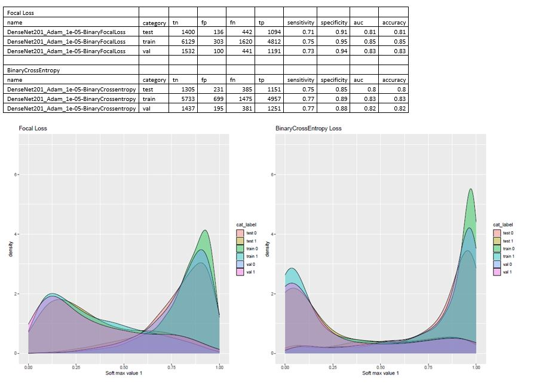

# Focal_loss


#### How to use Focal loss
Ex:
```
from focal_loss import BinaryFocalLoss

loss_func = BinaryFocalLoss(gamma=2)
model.compile(loss =loss_func, optimizer ='rmsprop',metrics =['accuracy'])
	
```


Thumbnail : Focal loss vs BinaryCrossEntropy loss

